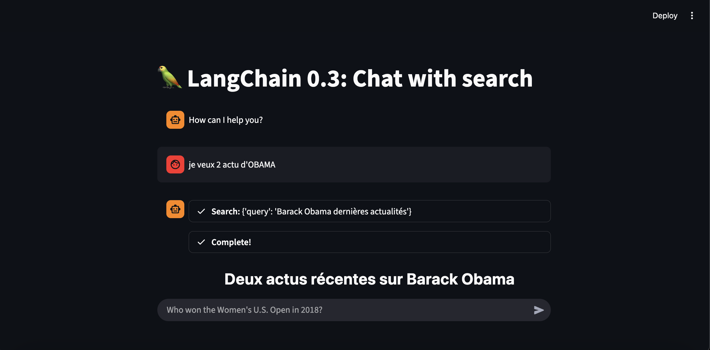
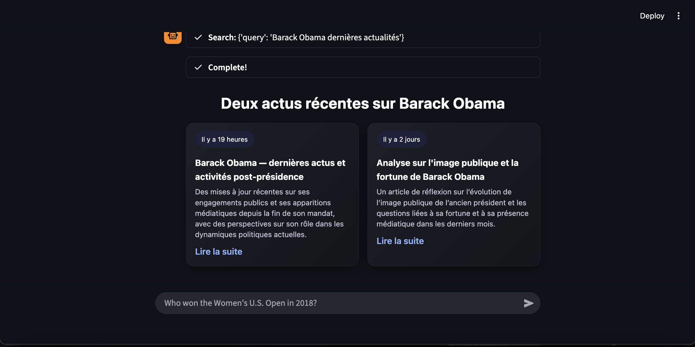
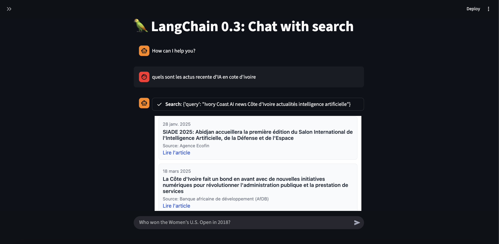
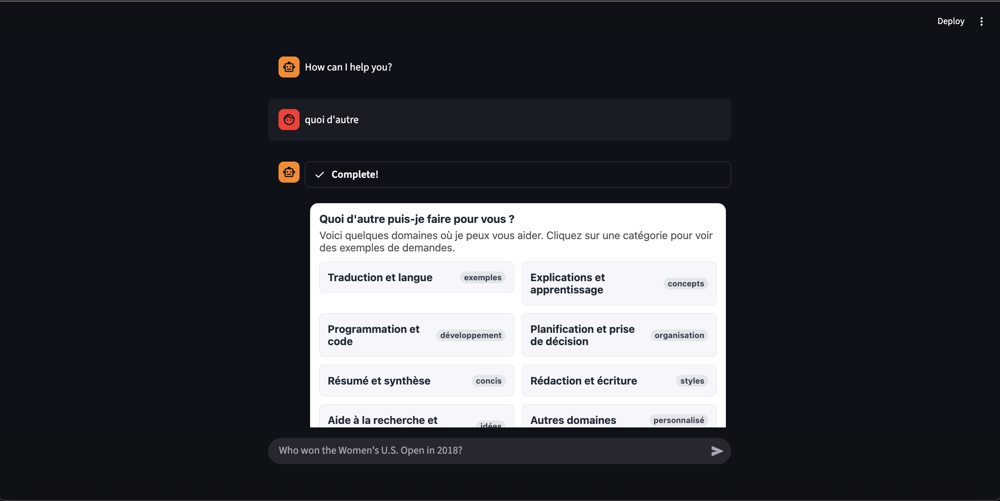
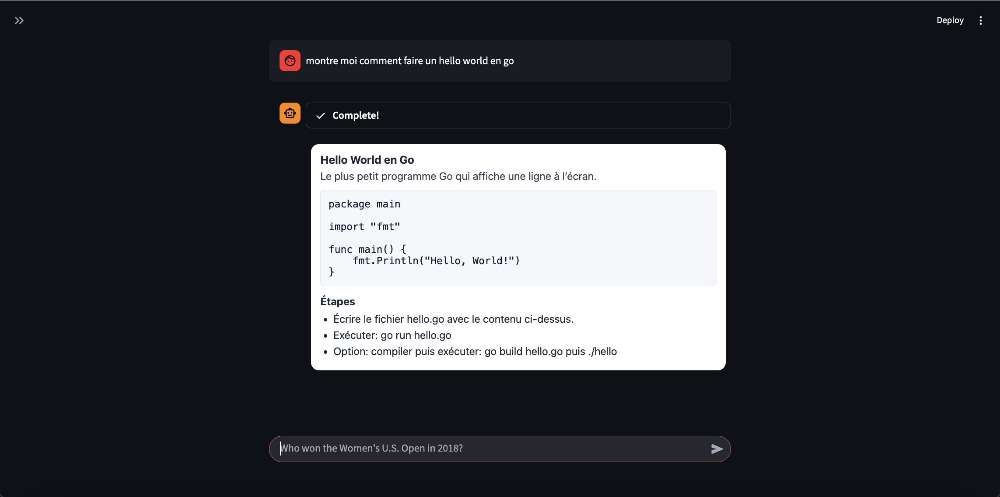

# Streamlit Agent

Lightweight chat app with web search, built on **LangChain 0.3** and **Streamlit**.
Uses a tool-calling agent, persistent chat history, and sandboxed HTML rendering.

---

## Features

* LangChain **0.3** agent (`create_tool_calling_agent` + `AgentExecutor`)
* Search tool: **DuckDuckGo**
* Streamed responses with **callbacks**
* Persistent history via **StreamlitChatMessageHistory**
* **RunnableWithMessageHistory** (no legacy memory)
* Sandboxed UI: answers render in **iframe** to avoid CSS bleed

---

## Project Layout

```
.
├── app.py                  # Streamlit entrypoint
├── src/                    # (optional) local modules
├── assets/
│   ├── imgs/               # screenshots
│   └── videos/             # demo recording
├── requirements.txt
└── readme.md
```

---

## Quickstart

### 1) Python & deps

```bash
python -V           # 3.10+ recommended
python -m venv .venv
source .venv/bin/activate   # Windows: .venv\Scripts\activate
pip install -r requirements.txt
```

### 2) Environment

Create a `.env` at project root:

```env
OPENAI_API_KEY=sk-...
MODEL_NAME=gpt-5-nano
# Optional:
# LANGCHAIN_TRACING_V2=true
# LANGCHAIN_API_KEY=...
```

### 3) Run

```bash
streamlit run app.py
```

---

## How It Works (brief)

* **LLM:** `ChatOpenAI(model=MODEL_NAME, streaming=True)`
* **Tools:** `[DuckDuckGoSearchRun(name="Search")]`
* **Agent:** `create_tool_calling_agent(llm, tools, prompt)`
* **Executor:** `AgentExecutor(..., return_intermediate_steps=True)`
* **History:** `RunnableWithMessageHistory` + `StreamlitChatMessageHistory`
* **UI:** Each AI turn renders via `components.html(...)` (isolated iframe)

---

## Key Code Ideas

**Prompt (system):** ask the model to return a self-contained HTML block, with all CSS scoped under a single container (e.g., `#app`), no global selectors.

**Sandboxing fix:** use:

```python
from streamlit.components.v1 import html as html_component

html_component(response["output"], height=600, scrolling=True)
```

This prevents a new answer’s CSS from breaking earlier messages.

**Intermediate steps:** stored in `st.session_state["steps"]` and shown inline under each message.

---

## Configuration

* `OPENAI_API_KEY` – required
* `MODEL_NAME` – default `gpt-5-nano` (change to any compatible chat model)
* Tooling: add/remove tools by editing the `tools` list
* Height/scrolling of HTML iframes: adjust `html_component(..., height=..., scrolling=...)`

---

## Common Issues

* **Previous messages’ layout breaks:** render AI HTML in an **iframe** (see sandboxing fix above). Avoid `st.html` or `st.write` for raw HTML.
* **No API key:** set `OPENAI_API_KEY` in `.env` or via sidebar input.
* **Tool not found:** ensure `langchain_community` is installed and in `requirements.txt`.

---

## Extend

* Add more tools (e.g., Wikipedia, Tavily, custom REST tools).
* Swap agent style (`create_react_agent`) if you prefer ReAct traces.
* Persist chat across sessions by backing `StreamlitChatMessageHistory` with a database.

---

## Demo & Screenshots

* **Demo video:** `assets/videos/streamlit-app-2025-10-01-17-10-42.webm`
* **Screenshots:**
  
  
  
  
  
  
---

## Scripts

```bash
# format/lint (example if you use these tools)
ruff check .
ruff format .
```

---

## License

MIT (update as needed).
